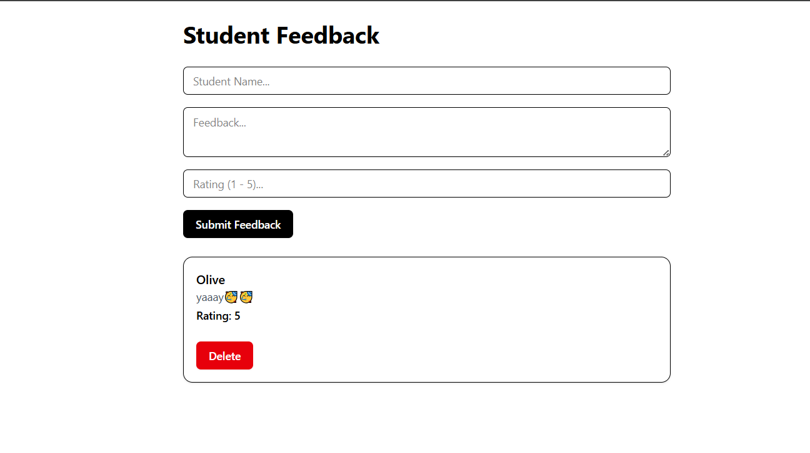

# 🎓 Student Feedback Form

A simple, elegant feedback submission web app for collecting student feedback. Built using **React**, **Tailwind CSS**, **shadcn/ui**, and **Vite**.

---

## 📸 Screenshot



---

## ⚙️ Features

- Add student name, comment, and rating (1–5)
- Dynamic list rendering using React state
- Delete feedback entries
- Styled using Tailwind CSS and shadcn components
- Form validation for empty fields
- Fully responsive and clean design

---

## 🚀 Tech Stack

- [React](https://react.dev/)
- [Vite](https://vitejs.dev/)
- [Tailwind CSS](https://tailwindcss.com/)
- [shadcn/ui](https://ui.shadcn.dev/)

---

## 🛠️ Installation

### 1. Clone the repository

```bash
git clone https://github.com/your-username/student-feedback-form.git
cd student-feedback-form
